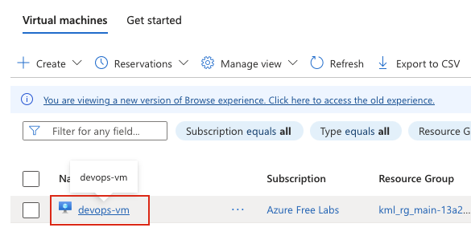
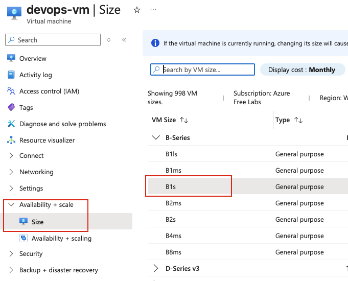
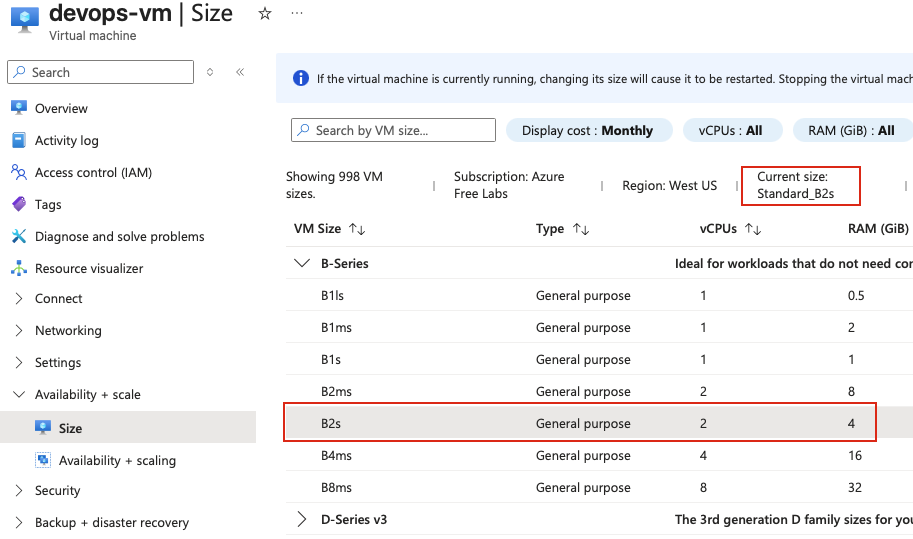
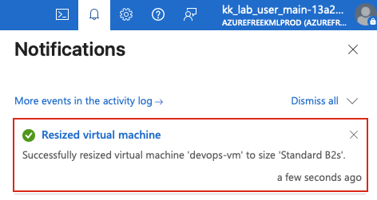
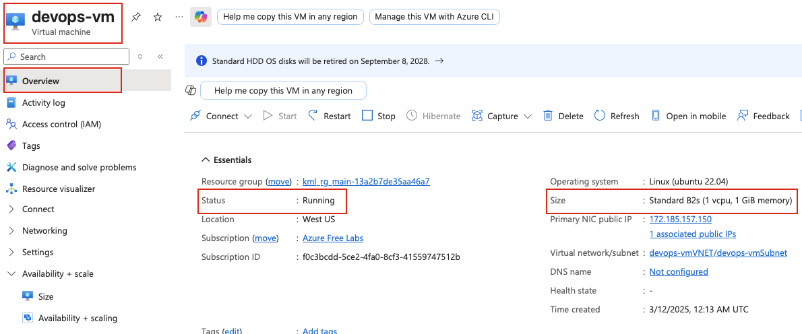

## Task: Change Azure Virtual Machine Size Using Console
The Nautilus DevOps team is migrating a portion of their infrastructure to Azure. During the migration, they have created several virtual machines (VMs) in different regions. The team has identified one VM that is underutilized and has decided to change its size to optimize resource usage.

1. Change the VM size from `Standard_B1s` to `Standard_B2s` for the virtual machine named `devops-vm`.

2. Ensure the VM is in the `running` state after the size change is complete.

---

## Solution

### **Step 1: Log in to Azure Portal**
Go to the Azure Portal:  
https://portal.azure.com  
Sign in with the credentials provided.

### **Step 2: Search for Virtual Machines**
- In the top search bar, type **Virtual Machines**.  
- Select **Virtual Machines** from the list.  

### **Step 3: Select the Virtual Machine**
- From the list of virtual machines, locate and click on **devops-vm**.  

### **Step 4: Navigate to Size Section**
- In the left-hand menu under **Availability + scale**, click on **Size**.  

### **Step 5: View Current VM Size**
- The current size will be displayed at the top, showing **Standard_B1s**.  
- You will see a list of available VM sizes that you can resize to.  

### **Step 6: Select New VM Size**
- In the list of available sizes, locate **Standard_B2s**.  
- You can use the search/filter box to quickly find it by typing `B2s`.  
- Click on **Standard_B2s** to select it.  

**VM Size Comparison:**
- **Standard_B1s:** 1 vCPU, 1 GiB RAM  
- **Standard_B2s:** 2 vCPUs, 4 GiB RAM  

### **Step 7: Resize the Virtual Machine**
- After selecting **Standard_B2s**, click the **Resize** button at the bottom of the page.  

**Important Notes:**
- The VM will automatically **stop and deallocate** during the resize operation.
- The resize process may take a few minutes.
- Azure will display a notification showing the progress of the resize operation.

### **Step 8: Wait for Resize Completion**
- Monitor the notification bell icon at the top-right of the Azure Portal.  
- Wait until you see a notification indicating **"Resize virtual machine completed successfully"**.  

### **Step 9: Verify VM Size and Status**
Once the VM has started:

- Go to the **Overview** page of **devops-vm**  
- Verify the **Size** field shows **Standard_B2s**  
- Verify the **Status** shows **Running**  

### Additional Notes

**Things to Consider When Resizing VMs:**
- **Downtime:** Resizing a VM requires stopping and deallocating it, which causes downtime. Plan accordingly.
- **Availability:** Not all VM sizes are available in all regions. If you don't see the desired size, it may not be available in your VM's region.
- **Size Family:** You can generally resize within the same VM family (e.g., B-series to B-series) without issues. Changing between different families may have restrictions.
- **Disk Constraints:** Some VM sizes have different limits on the number and type of disks that can be attached.
- **Network Performance:** Different VM sizes have different network bandwidth capabilities.
- **Cost:** Larger VM sizes cost more. The Standard_B2s will have higher costs than Standard_B1s.