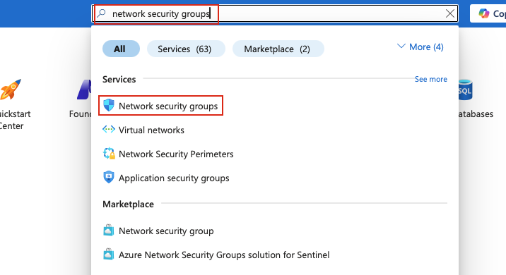
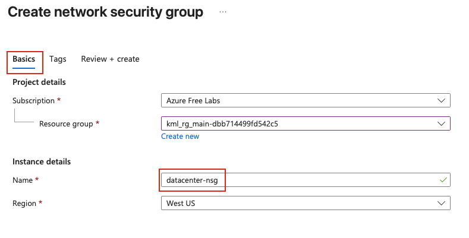
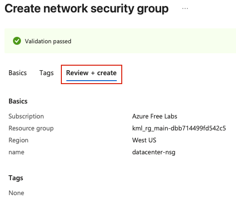
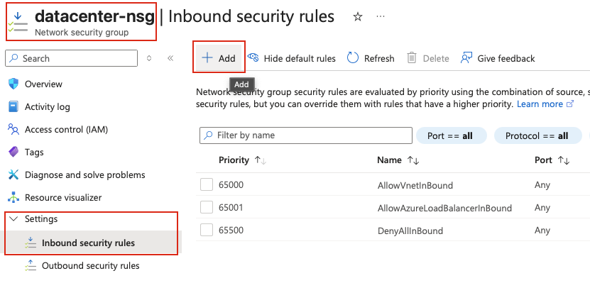
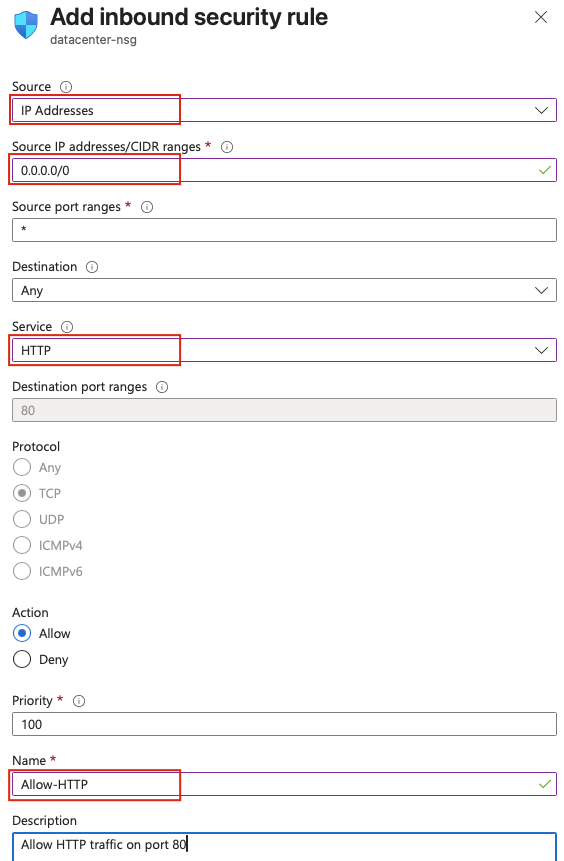
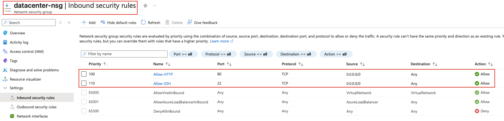

## Task: Create and Configure Network Security Group (NSG) in Azure
The Nautilus DevOps team is strategizing the migration of a portion of their infrastructure to the Azure cloud. Recognizing the scale of this undertaking, they have opted to approach the migration in incremental steps rather than as a single massive transition. To achieve this, they have segmented large tasks into smaller, more manageable units. This granular approach enables the team to execute the migration in gradual phases, ensuring smoother implementation and minimizing disruption to ongoing operations. By breaking down the migration into smaller tasks, the Nautilus DevOps team can systematically progress through each stage, allowing for better control, risk mitigation, and optimization of resources throughout the migration process.

For this task, create a network security group (NSG) with the following requirements:

- Name of the NSG should be `datacenter-nsg`.
- Add an inbound security rule named `Allow-HTTP` for `HTTP` service on port `80`, with the source CIDR range of `0.0.0.0/0`.
- Add another inbound security rule named `Allow-SSH` for `SSH` service on port `22`, with the source CIDR range of `0.0.0.0/0`.

---

## Solution

#### **Step 1: Log in to Azure Portal**
Go to the Azure Portal:  
https://portal.azure.com  
Sign in with the credentials provided.

#### **Step 2: Search for Network Security Groups**
- In the top search bar, type **Network security groups**.  
- Select **Network security groups** from the list.  

#### **Step 3: Create a New Network Security Group**
- Click **Create** 

#### **Step 4: Fill in the Basics Section**
Provide the following values:

- **Resource Group:** Select an existing resource group  
- **Name:** `datacenter-nsg`    
  

Leave other fields as default.

#### **Step 5: Review and Create**
- Review all the configuration settings  
- Click **Review + create**  
- Wait for validation to complete  
- Click **Create** to provision the Network Security Group  

Azure will now create the Network Security Group.

#### **Step 6: Navigate to the Created NSG**
Once deployment completes:

- Go to **Network security groups** from the Azure Portal  
- Locate and click on **datacenter-nsg**  
- In the left-hand menu under **Settings**, click on **Inbound security rules**  
- Click **+ Add** to create a new inbound rule  

#### **Step 7: Configure HTTP Rule**
In the **Add inbound security rule** panel, provide the following values:

- **Source:** `IP Addresses`  
- **Source IP addresses/CIDR ranges:** `0.0.0.0/0`   
- **Source port ranges:** `*` (default - any source port)  
- **Destination:** `Any`  
- **Service:** Select **HTTP** from the dropdown  
- **Destination port ranges:** `80` (automatically filled when HTTP is selected)  
- **Protocol:** `TCP` (automatically selected)  
- **Action:** `Allow`  
- **Priority:** `100` (or any value between 100-4096, lower numbers have higher priority)  
- **Name:** `Allow-HTTP`  
- **Description:** (Optional) `Allow HTTP traffic on port 80`  

Click **Add** to create the rule.

#### **Step 8: Add Inbound Security Rule for SSH**
Now we'll add the second inbound rule for SSH traffic. Click **+ Add** again to create another inbound rule.  

#### **Step 9: Configure SSH Rule**
In the **Add inbound security rule** panel, provide the following values:

- **Source:** `IP Addresses`  
- **Source IP addresses/CIDR ranges:** `0.0.0.0/0`   
- **Source port ranges:** `*` (default - any source port)  
- **Destination:** `Any`  
- **Service:** Select **SSH** from the dropdown  
- **Destination port ranges:** `22` (automatically filled when SSH is selected)  
- **Protocol:** `TCP` (automatically selected)  
- **Action:** `Allow`  
- **Priority:** `110` (must be different from the HTTP rule, e.g., 110)  
- **Name:** `Allow-SSH`  
- **Description:** (Optional) `Allow SSH traffic on port 22`  

Click **Add** to create the rule.

#### **Step 10: Verify Inbound Security Rules**
Once both rules are created:

- Stay on the **Inbound security rules** page of **datacenter-nsg**  
- Verify that both rules are listed:
   - **Allow-HTTP** - Port 80, Priority 100, Allow
   - **Allow-SSH** - Port 22, Priority 110, Allow  

