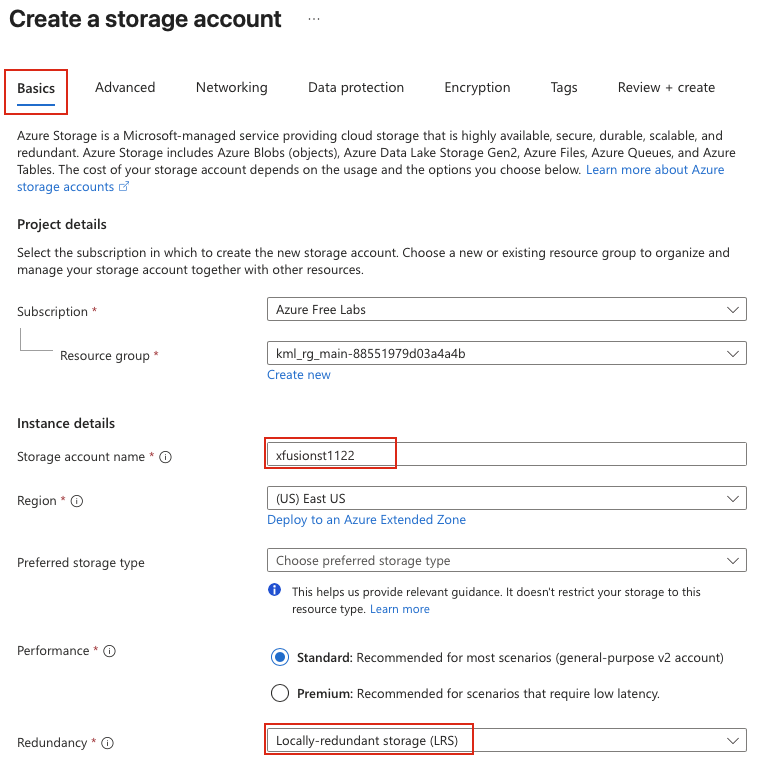
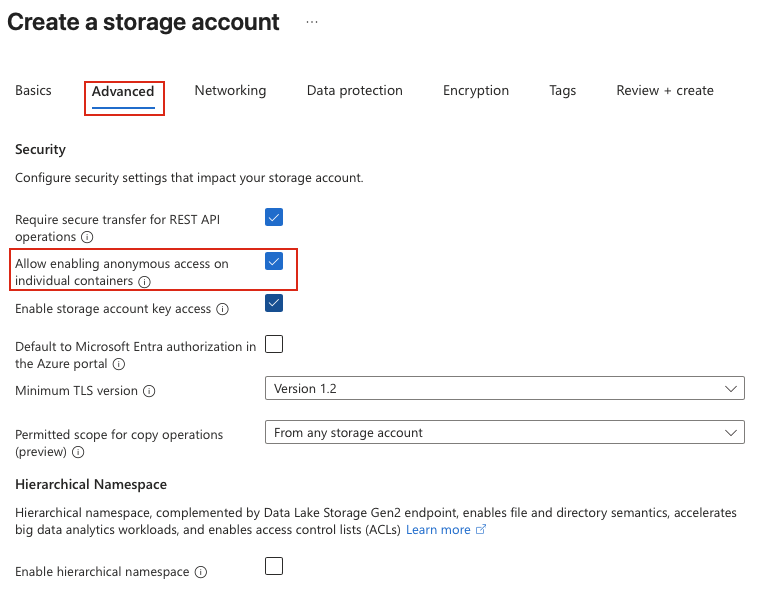
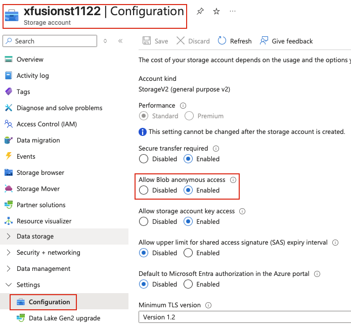
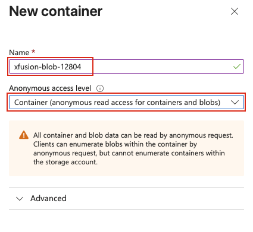
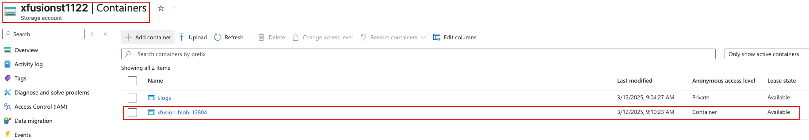

## Task: Create a Public Azure Blob Storage Container
As part of the data migration process, the Nautilus DevOps team is actively creating several storage containers on Azure. They plan to utilize public Blob containers to store the relevant data. Given the ongoing migration of other infrastructure to Azure, it is logical to consolidate data storage within the Azure environment as well.

Create a new storage account named `xfusionst1122` and a `public` Blob container named `xfusion-blob-12804` within the storage account. Make sure `anonymous read access for containers and blobs` is enabled.

---

## Solution

### **Step 1: Log in to Azure Portal**
Go to the Azure Portal:  
https://portal.azure.com  
Sign in with the credentials provided.

### **Step 2: Search for Storage Accounts**
- In the top search bar, type **Storage accounts**.  
- Select **Storage accounts** from the list.  

### **Step 3: Create a New Storage Account**
- Click **Create** 

### **Step 4: Fill in the Basics Section**
Provide the following values:

- **Resource Group:** Select an existing resource group  
- **Storage account name:** `xfusionst1122`  
- **Redundancy:** `Locally-redundant storage (LRS)`  

Click **Next: Advanced** to proceed.

### **Step 5: Configure Advanced Settings**

**IMPORTANT:** For public blob access to work, you must enable it at the storage account level.

In the **Advanced** tab:

- **Allow enabling anonymous access on individual containers:** Enabled   

Leave other options as default

### **Step 6: Review and Create Storage Account**
- Review all the configuration settings  
- **Verify that "Allow Blob public access" is Enabled**  
- Click **Review + create**  
- Wait for validation to complete  
- Click **Create** to provision the storage account  

Azure will now create the storage account. This may take a few moments.

### **Step 7: Verify Storage Account Creation**
Once deployment completes:

- Click **Go to resource** or navigate to **Storage accounts**  
- Locate and click on **xfusionst1122**  
- Verify the storage account details on the **Overview** page  

### **Step 8: Verify Blob Public Access is Enabled**
To confirm public access is enabled at the storage account level:

- In **xfusionst1122** storage account, go to **Settings** → **Configuration**  
- Scroll down to find **Allow Blob anonymous access**  
- Verify it shows **Enabled**  

If it shows **Disabled**, you need to enable it:
- Click on **Enabled**  
- Click **Save** at the top  

### **Step 9: Navigate to Containers**
From the **xfusionst1122** storage account page:

- In the left-hand menu under **Data storage**, click on **Containers**.  
- Click **Add container** at the top of the page.  

### **Step 10: Configure Container Settings for Public Access**
In the **New container** panel, provide the following values:

- **Name:** `xfusion-blob-12804`  
- **Public access level:** Select **Container (anonymous read access for containers and blobs)**  
- Click **Create** to create the public blob container.  

The container will be created immediately.

### **Step 11: Verify Container Creation and Public Access**
Once the container is created:

- You should see **xfusion-blob-12804** listed in the containers view  
- Check the **Anonymous access level** column shows **Container**  
- Click on the container name to view its details  

