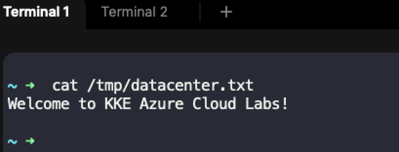
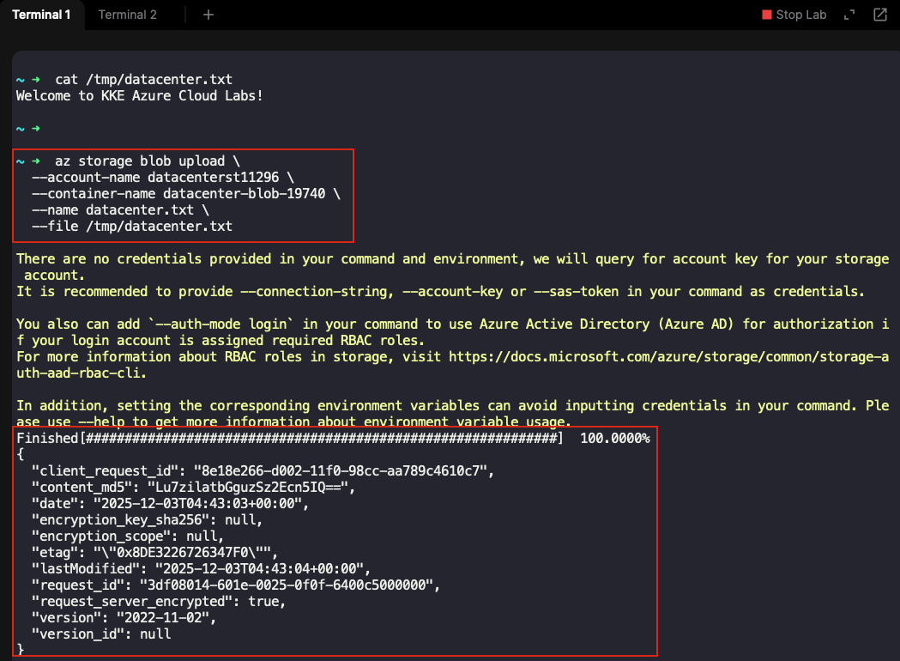
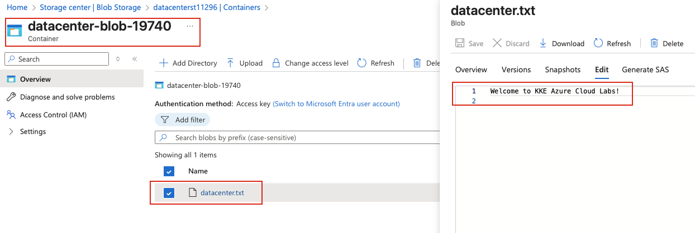

## Task: Copy Data to an Azure Blob Storage Container
The Nautilus DevOps team is presently immersed in data migrations, transferring data from on-premise storage systems to Azure Blob containers. They have recently received some data that they intend to copy to one of the Blob containers.

A Blob container named `datacenter-blob-19740` already exists in the `East US` region under the storage account `datacenterst11296`. Copy the file `/tmp/datacenter.txt` to the Blob container `datacenter-blob-19740`.

---

## Solution

Upload via Azure CLI (Command Line)

### **Step 1: Verify the File Exists**
First, check that the file exists on your local system:

```bash
# View file content (optional)
cat /tmp/datacenter.txt
```


### **Step 2: Upload the File Using Azure CLI**
Upload the file to the blob container:

```bash
# Upload file to blob container
az storage blob upload \
  --account-name datacenterst11296 \
  --container-name datacenter-blob-19740 \
  --name datacenter.txt \
  --file /tmp/datacenter.txt \
```

**Command Explanation:**
- `--account-name`: The storage account name
- `--container-name`: The target blob container name
- `--name`: The name of the blob in Azure (destination filename)
- `--file`: The local file path to upload  


### **Step 3: Verify the Upload via Azure portal(optional)**
- Login to Azure Portal  
- Navigate to **Storage accounts → Containers**
- In the container `datacenter-blob-19740` you should be able to see `datacenter.txt`  

