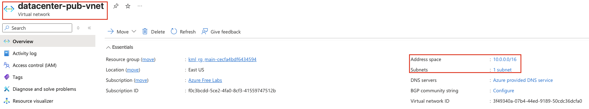
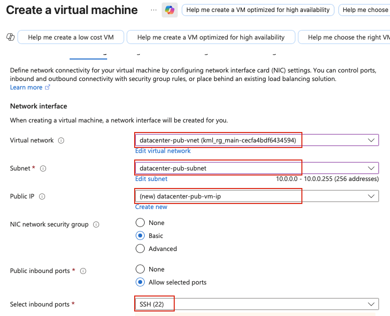
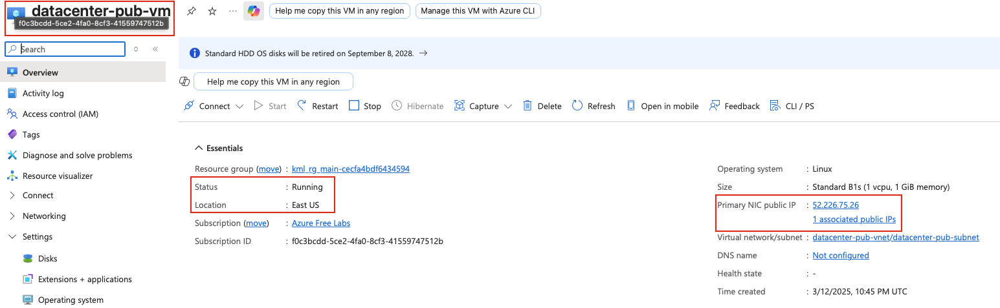

## Task: Deploying Virtual Machines in a Public Virtual Network
The Nautilus DevOps Team has received a request from the Networking Team to set up a new public VNet to support a set of public-facing services. This VNet will host various resources that need to be accessible over the internet. As part of this setup, you need to ensure the VNet has public subnets with automatic public IP assignment for resources. Additionally, a new VM will be launched within this VNet to host public applications that require SSH access.

1. Create a public VNet named `datacenter-pub-vnet`.
2. Create a subnet named `datacenter-pub-subnet` under the VNet.
3. Ensure public IP is being auto-assigned to resources under this subnet.
4. Create a VM named `datacenter-pub-vm` under this VNet.
5. Ensure SSH port `22` is open for this instance and accessible over the internet.
6. Use the Azure portal to complete the task and ensure SSH access is configured correctly.

---

## Solution

### **Step 1: Log in to Azure Portal**
Go to the Azure Portal:  
https://portal.azure.com  
Sign in with the credentials provided.

### **Step 2: Search for Virtual Networks**
- In the top search bar, type **Virtual networks**.  
- Select **Virtual networks** from the list.  

### **Step 3: Create a New Virtual Network**
- Click **+ Create** 

### **Step 4: Configure Basic Settings**
**Basics Tab:**

- **Resource Group:** Select an existing resource group  
- **Virtual network name:** `datacenter-pub-vnet`  

### **Step 5: Configure IP Address Space**
**IP Addresses Tab:**

- **IPv4 address space:** Use the default (e.g., `10.0.0.0/16`) or specify your own CIDR block
- You'll see a default subnet listed - we can either edit it or create another custom subnet  
- Click **Save** after making the necessary changes  

**IMPORTANT NOTE:** Azure doesn't have a specific "auto-assign public IP" setting at the subnet level like some other cloud providers. In Azure, public IP assignment is configured at the resource level (NIC/VM) during creation. When we create the VM later, we'll ensure it gets a public IP assigned.

### **Step 6: Review and Create VNet**
- Click **Review + create**
- Verify all settings:
  - VNet name: `datacenter-pub-vnet`
  - Subnet name: `datacenter-pub-subnet`
  - Address spaces configured correctly
- Click **Create**

Wait for the deployment to complete (usually takes 30-60 seconds).

### **Step 7: Verify VNet Creation**
Once deployment is complete:
- Click **Go to resource** or navigate to **Virtual networks**
- Select **datacenter-pub-vnet**
- Verify the VNet details:
  - Name: `datacenter-pub-vnet`
  - Subnets: Should show `datacenter-pub-subnet`

### **Step 8: Navigate to Virtual Machines**
- In the top search bar, type **Virtual Machines**
- Select **Virtual Machines** from the list
- Click **+ Create** → **Azure virtual machine**

### **Step 9: Configure VM Basic Settings**
**Basics Tab:**

- **Resource Group:** Select the same resource group used earlier
- **Virtual machine name:** `datacenter-pub-vm`
- **Region:** Select the **same region** as the VNet (very important!)
- **Availability options:** No infrastructure redundancy required
- **Image:** Select any available **Ubuntu** image  
- **Size:** `Standard_B1s`

**Administrator Account:**

- **Authentication type:** `SSH public key`
- **Username:** `azureuser`
- **SSH public key source:** Select `Generate new key pair` 
- **Key pair name:** `datacenter-pub-vm-key`

**Inbound Port Rules:**

- **Public inbound ports:** `Allow selected ports`
- **Select inbound ports:** Check **SSH (22)**  

### **Step 10: Configure Disks**
**Disks Tab:**

- **OS disk size:** Default
- **OS disk type:** `Standard HDD`
- **Delete with VM:** Checked

### **Step 11: Configure Networking (CRITICAL STEP)**
**Networking Tab:**

This is where we connect the VM to our public VNet and ensure public IP assignment.

- **Virtual network:** Select **datacenter-pub-vnet** **IMPORTANT**
- **Subnet:** Select **datacenter-pub-subnet** **IMPORTANT**
- **Public IP:** **Create new**  
- **NIC network security group:** `Basic`
- **Public inbound ports:** `Allow selected ports`
- **Select inbound ports:** Verify **SSH (22)** is checked  

### **Step 12: Review and Create VM**
- Review all configuration settings:
  - VM name: **datacenter-pub-vm**
  - VNet: **datacenter-pub-vnet**
  - Subnet: **datacenter-pub-subnet**
  - Public IP: **Enabled**
  - SSH port 22: **Open**
- Click **Review + create**
- Wait for validation to complete
- Click **Create**

### **Step 13: Wait for VM Deployment**
The VM creation will take 3-5 minutes. Monitor the deployment progress.
Once complete, click **Go to resource** to view the VM details.

