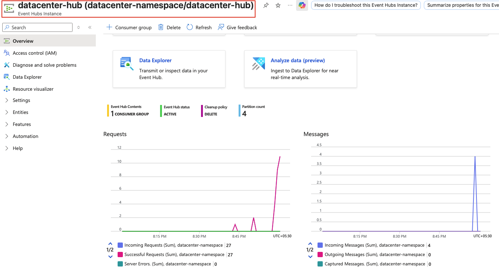
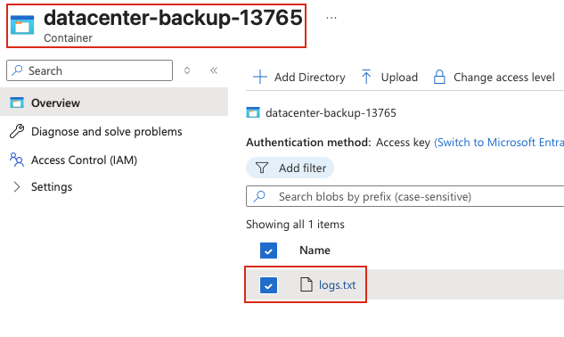

## Task: EventHub to Blob Storage Integration Setup
The Nautilus DevOps team wants to integrate an Azure Virtual Machine with Azure Event Hubs and Azure Blob Storage for centralized log collection and backup. Follow these steps to complete the task.

1. **Create Azure Event Hubs Namespace:**
   - Create an Event Hubs namespace named `datacenter-namespace` in the East US region
   - Select the Standard pricing tier. Make sure to enable `Enable Auto-inflate`

2. **Create an Event Hub:**
   - Within the namespace, create an Event Hub named `datacenter-hub`

3. **Set Up Azure Blob Storage for Log Backup:**
   - Create a Storage Account named `datacenterst824` in the East US region
   - Create a container named `datacenter-backup-13765` within the Storage Account
   - Ensure the container is publicly accessible for read operations

4. **Verify the Virtual Machine Configuration:**
   - The client host already has a Python script named `send_logs.py` located under `/root`. This script is used to send logs to the Event Hub
   - Create a Virtual Machine named `datacenter-vm` in the East US region
   - Copy the `send_logs.py` script from the client host to the `/home/azureuser` directory of the `datacenter-vm`
   - Modify the script on the VM to also back up the logs to the `datacenter-backup-13765` container in the Azure Blob Storage account

5. **Verify Logs:**
   - Ensure the logs are successfully sent to the Event Hub by checking the Event Hubs metrics in the Azure portal
   - Verify that the logs are backed up to the `datacenter-backup-13765` container in the Azure Blob Storage

---

## Solution

We'll be performing this task using Azure CLI.

### **Step 1: Login to Azure CLI**
```bash
az login
```
Follow the instructions and ensure that you are logged in.

### **Step 2: Set Variables**
Define variables for easier management:
```bash
RESOURCE_GROUP=$(az group list --query "[0].name" -o tsv)
NAMESPACE="datacenter-namespace"
EVENT_HUB="datacenter-hub"
STORAGE_ACCOUNT="datacenterst824"
CONTAINER="datacenter-backup-13765"
VM_NAME="datacenter-vm"
```

### **Step 3: Create Event Hubs Namespace**
```bash
az eventhubs namespace create \
  --name $NAMESPACE \
  --resource-group $RESOURCE_GROUP \
  --location eastus \
  --sku Standard \
  --enable-auto-inflate true \
  --maximum-throughput-units 2
```

### **Step 4: Create an Event Hub**
```bash
az eventhubs eventhub create \
  --name $EVENT_HUB \
  --namespace-name $NAMESPACE \
  --resource-group $RESOURCE_GROUP
```

### **Step 5: Get event hub connection string**
```bash
EH_CONN_STRING=$(az eventhubs namespace authorization-rule keys list \
  --resource-group $RESOURCE_GROUP \
  --namespace-name $NAMESPACE \
  --name RootManageSharedAccessKey \
  --query primaryConnectionString -o tsv)
```
We'll be using this connection string in the script.

### **Step 6: Set Up Azure Blob Storage for Log Backup**
Create storage account
```bash
az storage account create \
  --name $STORAGE_ACCOUNT \
  --resource-group $RESOURCE_GROUP \
  --location eastus \
  --sku Standard_LRS \
  --kind StorageV2 \
  --allow-blob-public-access true
```

Get storage account connection string. We'll be using this connection string in the script.
```bash
STORAGE_CONN_STRING=$(az storage account show-connection-string \
  --name $STORAGE_ACCOUNT \
  --resource-group $RESOURCE_GROUP \
  --query connectionString \
  -o tsv)
```

Create storage container
```bash
az storage container create \
  --name $CONTAINER \
  --connection-string "$STORAGE_CONN_STRING" \
  --public-access container
```

### **Step 7: Create Virtual Machine**
```bash
az vm create \
  --resource-group $RESOURCE_GROUP \
  --name $VM_NAME \
  --image Ubuntu2204 \
  --size Standard_B1s \
  --os-disk-size-gb 30 \
  --storage-sku Standard_LRS \
  --admin-username azureuser \
  --generate-ssh-keys \
  --location eastus
```

### **Step 8: Get public IP of the VM**
```bash
VM_PUBLIC_IP=(az vm show \
  --resource-group $RESOURCE_GROUP \
  --name $VM_NAME \
  --show-details \
  --query publicIps -o tsv)
```

### **Step 9: Edit the send_logs.py file**
Replace the connection string placeholders with the actual connection strings.
```bash
# Event hub connection string
echo $EH_CONN_STRING

# Storage account connection string
echo $STORAGE_CONN_STRING
```

### **Step 10: Copy the send_logs.py file to the VM**
Copy script to VM
```bash
scp -i ~/.ssh/id_rsa /root/send_logs.py azureuser@$VM_PUBLIC_IP:/home/azureuser/
```

### **Step 11: Run the script from the VM**
SSH to the VM
```bash
ssh azureuser@$VM_PUBLIC_IP
```
Install pip for Python 3
```bash
sudo apt update
sudo apt install -y python3-pip
```
Install the required Azure SDK libraries
```bash
pip3 install azure-storage-blob azure-eventhub
```
Run the script(preferably multiple times)
```bash
python3 send_logs.py
```

### **Step 12: Verify the metrics from the portal**
Check the Event Hubs metrics in the Azure portal  


Check the container in the Azure Blob Storage for the log file  

