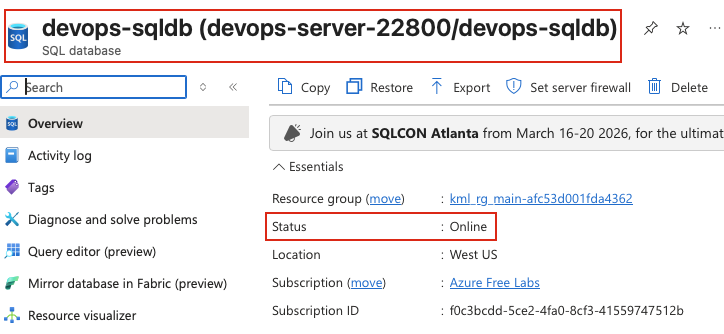
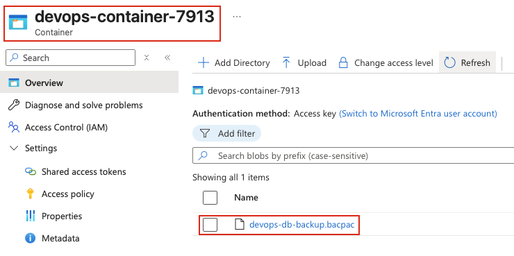
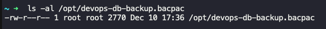

## Task: SQL Database Migration and Setup
The Nautilus DevOps team is strategizing the migration of a portion of their infrastructure to Azure. Recognizing the scale of this undertaking, they have opted to approach the migration in incremental steps rather than as a single massive transition. As part of this migration, they are focusing on setting up and managing Azure SQL Databases, implementing backup processes, and ensuring data recovery. Below are the tasks they require you to perform:

**Task 1: Create an Azure SQL Database**
1. Create a publicly accessible Azure SQL Database instance with the following details:
    - Database Name: `devops-sqldb`.
    - Server Name: `devops-server-22800`.
    - Backup Storage Redundancy: `Locally-redundant backup storage`.
    - Hardware Configuration: `Basic (For less demanding workloads)`.
    - Admin Username: `devops-admin`.
    - Admin Password: Set an appropriate password.
    - Database Size: Set to `2 GiB`.
    - Keep all other configurations as default.
2. Ensure the database is in the `Ready` state.

**Task 2: Create a Storage Account**
1. Create a Storage Account named `devopsst27208`.
2. Configure a Blob Container named `devops-container-7913` within this storage account.

**Task 3: Backup the Azure SQL Database**
1. Take a backup of the Azure SQL Database instance `devops-sqldb` and store it in the Blob Container:
    - Storage Account: `devopsst27208`.
    - Blob Container: `devops-container-7913`.
    - Backup File Name: `devops-db-backup`.
2. Ensure the backup is fully exported to the blob container.

**Task 4: Download the Backup**
1. Download the backup file from the Blob Container to the `/opt` directory on the `azure-client` host.
2. Ensure the file is accessible and properly named based on its extension.

**Requirements for Completion**
- Ensure the SQL Database is in the `Ready` state.
- Confirm the backup is stored in the specified Blob Container.
- Verify the backup file is successfully downloaded to the `/opt` directory on the client host.

---

## Solution

We'll be performing this task using Azure CLI.

### **Step 1: Login to Azure CLI**
```bash
az login
```
Follow the instructions and ensure that you are logged in.

### **Step 2: Set Variables**
Define variables for easier management:
```bash
RESOURCE_GROUP=$(az group list --query "[0].name" -o tsv)
DATABASE="devops-sqldb"
SERVER_NAME="devops-server-22800"
ADMIN_USER="devops-admin"
ADMIN_PASS="YourStrongPassword123!"
STORAGE_ACCOUNT="devopsst27208"
CONTAINER="devops-container-7913"
```

### **Step 3: Create Azure SQL Database**
Create the SQL Server
```bash
az sql server create \
  --name $SERVER_NAME \
  --resource-group $RESOURCE_GROUP \
  --location westus \
  --admin-user $ADMIN_USER \
  --admin-password $ADMIN_PASS
```
Allow public network access
```bash
az sql server firewall-rule create \
  --resource-group $RESOURCE_GROUP \
  --server $SERVER_NAME \
  --name AllowAll \
  --start-ip-address 0.0.0.0 \
  --end-ip-address 255.255.255.255
```
Create the SQL Database
```bash
az sql db create \
  --resource-group $RESOURCE_GROUP \
  --server $SERVER_NAME \
  --name $DATABASE \
  --edition Basic \
  --max-size 2GB \
  --backup-storage-redundancy Local
```

### **Step 4: Verify DB is Ready**
```bash
az sql db show \
  --resource-group $RESOURCE_GROUP \
  --server $SERVER_NAME \
  --name $DATABASE \
  --query status
```
Expected output: **"Online"**

### **Step 5: Create Storage Account & Container**
Create storage account
```bash
az storage account create \
  --name $STORAGE_ACCOUNT \
  --resource-group $RESOURCE_GROUP \
  --location westus \
  --sku Standard_LRS \
  --kind StorageV2
```

Get Storage Account Connection String
```bash
STORAGE_CONN=$(az storage account show-connection-string \
  --name $STORAGE_ACCOUNT \
  --resource-group $RESOURCE_GROUP \
  --query connectionString -o tsv)
```

Create Blob Container
```bash
az storage container create \
  --name $CONTAINER \
  --connection-string "$STORAGE_CONN"
```

### **Step 6: Backup (Export) Azure SQL Database**
Azure SQL DB backups require:
- Storage account key
- Container URL
- Filename ending in .bacpac

Get storage key
```bash
SA_KEY=$(az storage account keys list \
  --resource-group $RESOURCE_GROUP \
  --account-name $STORAGE_ACCOUNT \
  --query "[0].value" -o tsv)
```

Export backup
```bash
az sql db export \
  --resource-group $RESOURCE_GROUP \
  --server $SERVER_NAME \
  --name $DATABASE \
  --storage-key-type StorageAccessKey \
  --storage-key "$SA_KEY" \
  --storage-uri "https://$STORAGE_ACCOUNT.blob.core.windows.net/$CONTAINER/devops-db-backup.bacpac" \
  --admin-user $ADMIN_USER \
  --admin-password $ADMIN_PASS
```

### **Step 7: Download backup to /opt  directory on azure-client**
```bash
az storage blob download \
  --container-name $CONTAINER \
  --name devops-db-backup.bacpac \
  --file /opt/devops-db-backup.bacpac \
  --connection-string "$STORAGE_CONN"
```

### **Step 8: Verify setup**
Check the database status from the Azure portal  


Check if the backup is stored in the Blob Container  


Verify if the backup file is downloaded to the `/opt` directory on the client host
```bash
ls -al /opt/devops-db-backup.bacpac
```
