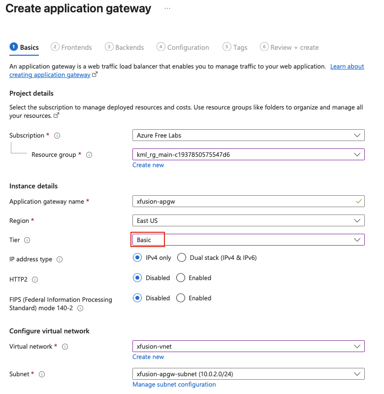

## Task: VM Setup and Configuration for Azure Application Gateway
The Nautilus DevOps team needs to set up an Azure Application Gateway to manage traffic for a backend pool of virtual machines. The gateway will serve as a load balancer, distributing traffic across the VMs.

Task:

1. **Azure Virtual Network and Subnet**:
    - Create a Virtual Network (VNet) named `xfusion-vnet` in the **East US** region.
    - Create a Subnet named `xfusion-subnet` within the VNet for the VMs.
    - Create a Subnet named `xfusion-apgw-subnet` within the VNet for the Application Gateway.
2. **Azure Virtual Machines**:
    - Create two VMs named `xfusion-vm1` and `xfusion-vm2` in the **East US** region.
    - Install Nginx on both VMs.
    - Configure `index.html` on VM1 to display **"Welcome to KKE Labs:Version 1"**.
    - Configure `index.html` on VM2 to display **"Welcome to KKE Labs:Version 2"**.
3. **Azure Application Gateway**:
    - Create an Application Gateway named `xfusion-apgw` in the East US region.
    - Assign the `xfusion-apgw-subnet` to the Application Gateway.
    - Create a frontend IP configuration named `xfusion-apgw-ip`.
    - Add the VMs `xfusion-vm1` and `xfusion-vm2` to the backend pool.
    - Configure a basic routing rule to distribute traffic between the VMs.
4. **Validation**:
    - Verify that the Application Gateway distributes traffic to both VMs.
    - Ensure that accessing the Application Gateway URL displays either "Welcome to KKE Labs:Version 1" or "Welcome to KKE Labs:Version 2" depending on the load balancing.

--- 

## Solution

### **Step 1: Login to Azure CLI**
**From `azure-client` host**
```bash
az login
```
Follow the instructions and ensure that you are logged in.

### **Step 2: Set Variables**
Define variables for easier management:
```bash
RESOURCE_GROUP=$(az group list --query "[0].name" -o tsv)
LOCATION="eastus"
VNET="xfusion-vnet"
SUBNET_VM="xfusion-subnet"
SUBNET_APGW="xfusion-apgw-subnet"
VM1="xfusion-vm1"
VM2="xfusion-vm2"
```

### **Step 3: Create VNet and Subnets**
Create VNet with VM subnet
```bash
az network vnet create \
  -g $RESOURCE_GROUP \
  -n $VNET \
  -l $LOCATION \
  --address-prefix 10.0.0.0/16 \
  --subnet-name $SUBNET_VM \
  --subnet-prefix 10.0.1.0/24
```
Create Application Gateway subnet
```bash
az network vnet subnet create \
  -g $RESOURCE_GROUP \
  --vnet-name $VNET \
  -n $SUBNET_APGW \
  --address-prefix 10.0.2.0/24
```

### **Step 4: Create Azure Virtual Machines**
Generate SSH key on `azure-client` host
```bash
ssh-keygen
```
Create VM1
```bash
az vm create \
  -g $RESOURCE_GROUP \
  -n $VM1 \
  --image Ubuntu2204 \
  --admin-username azureuser \
  --ssh-key-values ~/.ssh/id_rsa.pub \
  --vnet-name $VNET \
  --subnet $SUBNET_VM \
  --public-ip-sku Standard \
  --storage-sku Standard_LRS \
  --location $LOCATION \
  --size Standard_B1s
```
Open port `80` for web access
```bash
az vm open-port \
  --port 80 \
  --resource-group $RESOURCE_GROUP \
  --name $VM1
```

Create VM2
```bash
az vm create \
  -g $RESOURCE_GROUP \
  -n $VM2 \
  --image Ubuntu2204 \
  --admin-username azureuser \
  --ssh-key-values ~/.ssh/id_rsa.pub \
  --vnet-name $VNET \
  --subnet $SUBNET_VM \
  --public-ip-sku Standard \
  --storage-sku Standard_LRS \
  --location $LOCATION \
  --size Standard_B1s
```
Open port `80` for web access
```bash
az vm open-port \
  --port 80 \
  --resource-group $RESOURCE_GROUP \
  --name $VM2
```

### **Step 5: Install NGINX and configure index.html on each VM**
For VM1
```bash
az vm run-command invoke \
  -g $RESOURCE_GROUP \
  -n $VM1 \
  --command-id RunShellScript \
  --scripts "
    sudo apt update &&
    sudo apt install -y nginx &&
    echo 'Welcome to KKE Labs:Version 1' | sudo tee /var/www/html/index.html &&
    sudo systemctl start nginx &&
    sudo systemctl enable nginx
  "
```

For VM2
```bash
az vm run-command invoke \
  -g $RESOURCE_GROUP \
  -n $VM2 \
  --command-id RunShellScript \
  --scripts "
    sudo apt update &&
    sudo apt install -y nginx &&
    echo 'Welcome to KKE Labs:Version 2' | sudo tee /var/www/html/index.html &&
    sudo systemctl start nginx &&
    sudo systemctl enable nginx
  "
```

### **Step 6: Create Azure Application Gateway**
**Note:** Creating a `Basic` tier application gateway via Azure CLI isn't supported at the time of this documentation, hence we'll be creating it via Azure portal.  


Refer to [Day43](Day43.md) on how to create an Application Gateway from Azure portal. Wait for the deployment to complete.

### **Step 7: Get Application Gateway Public IP**
Once the Application Gateway is deployed:
- Navigate to the `xfusion-agw` resource
- In the left menu, click **Frontend IP configurations** under **Settings**
- Note the **Public IP address**

### **Step 8: Test Web Servers Access via Application Gateway**
Test the web servers using the Application Gateway public IP:

**Using Web Browser:**
- Open a web browser
- Navigate to: `http://<AGW-PUBLIC-IP>`